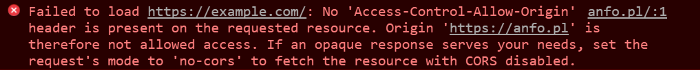
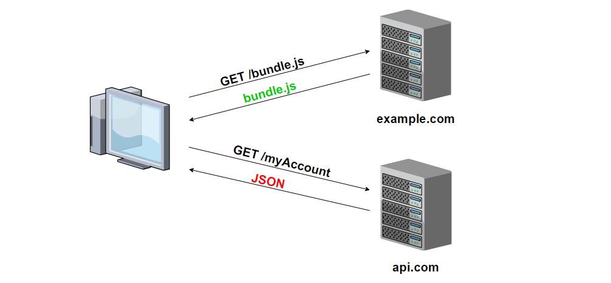
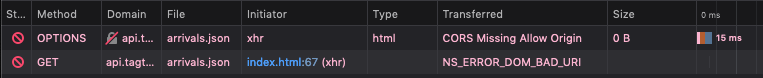

# SOP - Same Origin Policy
# CORS - Cross-Origin Resource Sharing

## Bakgrund

|  |
|:--:|
| fig 1. CORS error meddelande |

* Anledningen till ovanstående är CORS-implementationen i webbläsare
* En domänresurs anropar annan

|  |
|:--:|
| fig 2. CORS |

CORS träder in i följande fall

* Annan domän - example.com anropar api.com
* Annan subdomän - subdomän på example.com anropar api.com
* Annan port - example.com anropar example.com:3000
* Annat protokoll - https://example.com anropar http://example.com

## Bakom skynket

Javascript XMLHttpRequest eller Fetch genererar en ```HTTP GET```

1. Webbläsarens CORS mekanism bryter in och gör en "test request" (preflight) med ```HTTP OPTION``` metoden

|  |
|:--:|
| fig 1. CORS genomför en preflight med HTTP OPTION metoden |

2. Om villkoren uppfylls för godkänd preflight så genomförs en ```HTTP GET``` i ett andra steg
3. Javascript får tillgång till responsen. Se bild 3

## preflight

* Icke-enkla HTTP requests startar en mekanism som kallas *preflight*
* Exempel på icke-enkla requests är...
  * requests som inkluderar cookies
  * ```Content-type``` som inte är ```application/x-ww-form-urlencoded```, ```multipart/form-data``` eller ```text-plain```

## Lösning

### 1 - Tillgång till client- och server kod

* Ange en vitlista i ```Access-Control-Allow-Origin``` headern på servern ```'*'``` tillåter alla

### 2 - Temporär lösning

* Genom en plug-in i webbläsaren kan man sätta CORS ur spel

### 3 - Tillgång till client kod med inte server kod

* Använd proxyserver
